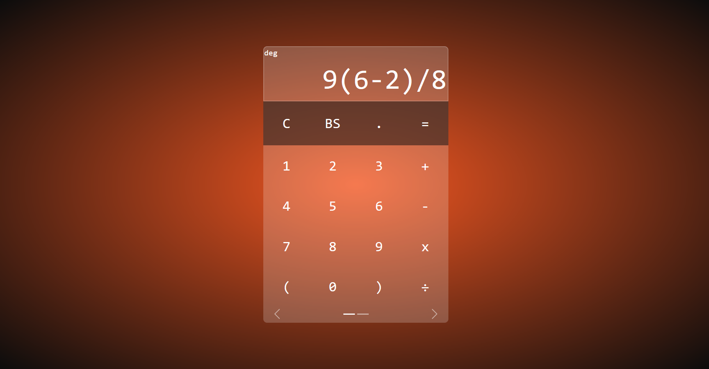
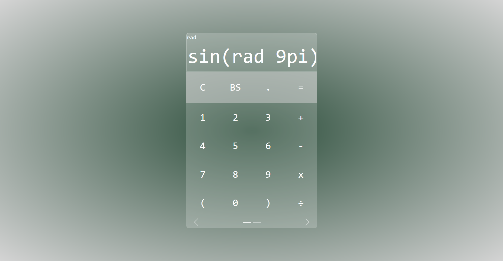
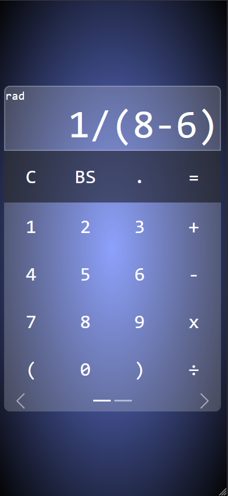
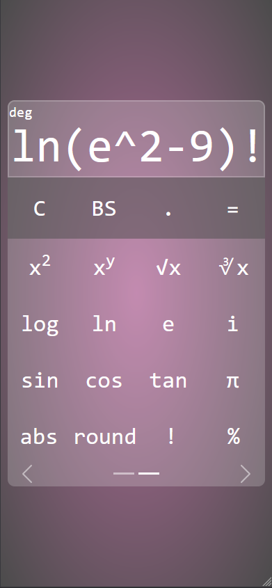

# Calculator Program

A simple yet useful web calculator program, able to do from sum and subtraction to sine and cossine. It's made with HTML, CSS (with [Bootstrap](https://getbootstrap.com/)) and JavaScript (with [jQuery](https://jquery.com/) and [Math.js](https://mathjs.org/)).

#### Examples

- PC-like screen:

 

- Mobile-like screen:

 

## Functionalities

- The background gradient colors change with reload.

- The upper left "deg" is a button that switchs between degrees and radians.

- It's possible to focus on calculator's screen and write on it or use keyboard buttons instead of the calculator 's buttons.

- The fixed buttons are: clear (C or Delete), backspace (BS or Backspace), point (.) and equals (= or Enter).

- The keyboard's first panel brings numbers and the most used operators: plus, minus, times and divide.

- The keyboard's second panel brings square power, power, square root, cubic root, common logarithm, natural logarithm, euler number, imaginary number, sine, cossine, tangent, pi, absolute, round, factorial and percentage buttons.

## Contributing

Anyone can contribute with issues and pull requests: more advanced functions can be added via new keyboard panels!

Also, code reviews, suggestions and ratings are appreciated!

## Usage

The program can be accessed by downloading all the files and opening index.html on a browser.

## Author

#### João Vitor Sobral

Github: sobraljvss  
Contact: sobraljvss@gmail.com

## Credits

The icon was also made by João Vitor Sobral.